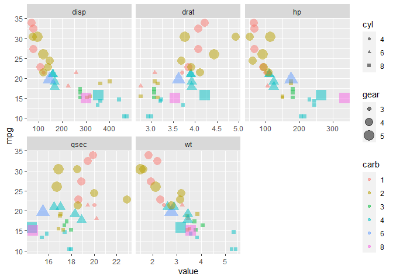

Coolest Thing About R
================
Mark Gordon
2022-06-08

## What’s the coolest thing about R?

I would have to say that one of the coolest things about R is `ggplot2`.
While a bit of a steep learning curve (I self-taught myself a lot in
ST502 for the final project), the power and flexibility is pretty
amazing. Something similar to what I created for the last homework is
below:

## Easily facet wrap a data set with gather

``` r
# Load Libraries
library(tidyverse)

# Factorize everything with a unique count of 6 or less
mtcars <- as_tibble(mtcars)
col_names <- sapply(mtcars, function(col) length(unique(col)) <= 6)
mtcars[, col_names] <- lapply(mtcars[, col_names], factor)

# Create a faceted plot using gather
mtcars %>%
  gather("key", "value", colnames(select_if(.[-1], is.numeric))) %>%
  ggplot(aes(x = value, y = mpg, color = carb, size = gear, shape = cyl)) +
  geom_point(alpha = 0.5) +
  facet_wrap(~ key, scales = "free_x")
```

    ## Warning: Using size for a discrete variable is not advised.

<!-- -->

<!-- rmarkdown::render("_Rmd/2022-06-30-coolest-thing-about-r.Rmd", output_format = "github_document", output_dir = "_posts", output_options = list(html_preview = "false")) -->
